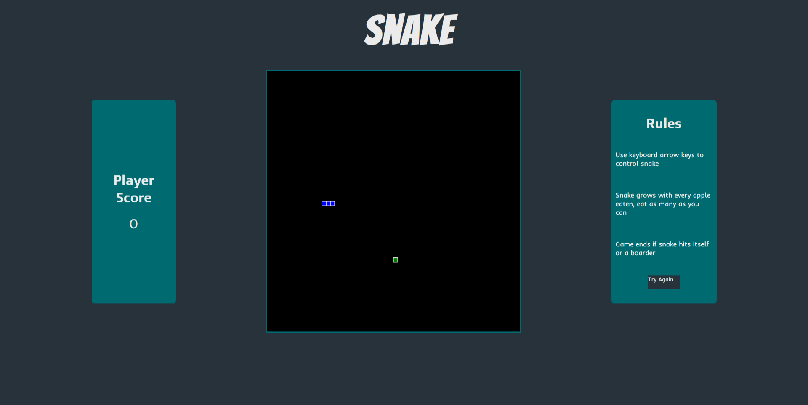

# JS-Snake

A classic game of snake made with HTML, CSS and JavaScript. 

Play [Snake](https://cesarpreza.github.io/js-snake/)

# How to play: 

 - Use the keyboard arrow keys to control the snake
 - The snake grows with every apple eaten
 - Eat as many as you can without running into yourself or a border
 
 # Reference Image 
 
 
 
 # Summary
 
 This game was tons of fun to work on. This is the second game I've made, my first being a Rock Paper Scissors game which you can also check out [here](https://cesarpreza.github.io/rock-paper-scissors/). The main takeaway I took from making this Snake Game was working with the canvas element. Working on this alone shows how versatile the canvas is. Also having to think about how the Snake and Apple in the game work together and having their locations be mapped on the canvas was a tough but fun puzzle to solve. Overall this was a fun project and a great stepping stone for game creation.  
 
 # Author
 
 Cesar Preza - Software Developer [LinkedIn](https://www.linkedin.com/in/cesar-preza-72675278/)
